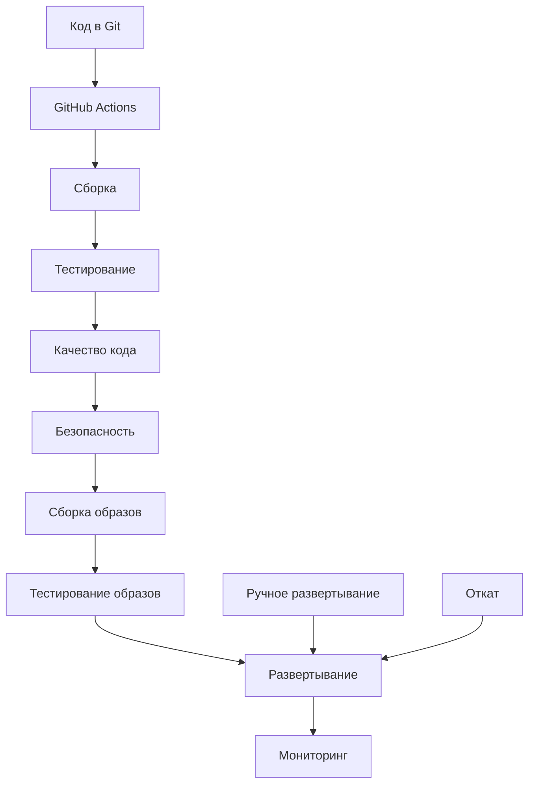

# CI/CD процессы czn-dioxus

Этот документ описывает системы непрерывной интеграции и непрерывной доставки для приложения czn-dioxus.

## Обзор CI/CD

Наша система CI/CD обеспечивает:

- **Автоматизацию** - Полная автоматизация процессов сборки и тестирования
- **Качество** - Автоматическая проверка качества кода
- **Безопасность** - Проверка безопасности и уязвимостей
- **Надежность** - Автоматическое развертывание и откат
- **Скорость** - Быстрая доставка изменений в production

## Архитектура CI/CD



## Системы и инструменты

### 1. GitHub Actions

**Описание**: Основная система CI/CD

**Преимущества**:
- Интеграция с GitHub
- Гибкость конфигурации
- Большое количество готовых actions
- Поддержка матричных сборок

### 2. Docker

**Описание**: Контейнеризация приложения

**Преимущества**:
- Изоляция окружения
- Повторяемость сборок
- Простота развертывания
- Поддержка разных платформ

### 3. SonarQube

**Описание**: Анализ качества кода

**Преимущества**:
- Обнаружение багов и уязвимостей
- Анализ покрытия тестами
- Технический долг
- Сравнение с эталонами

## Pipeline конфигурации

### 1. Основной pipeline

**Файл**: `.github/workflows/ci.yml`

```yaml
name: CI/CD Pipeline

on:
  push:
    branches: [ main, develop ]
  pull_request:
    branches: [ main ]

env:
  REGISTRY: ghcr.io
  IMAGE_NAME: ${{ github.repository }}

jobs:
  # Сборка и тестирование
  build-and-test:
    runs-on: ubuntu-latest
    
    steps:
    - name: Checkout code
      uses: actions/checkout@v4
      
    - name: Setup Rust
      uses: actions-rs/toolchain@v1
      with:
        toolchain: stable
        override: true
        
    - name: Cache cargo registry
      uses: actions/cache@v3
      with:
        path: |
          ~/.cargo/registry
          ~/.cargo/git
          target
        key: ${{ runner.os }}-cargo-${{ hashFiles('**/Cargo.lock') }}
        
    - name: Build
      run: cargo build --verbose
      
    - name: Run tests
      run: cargo test --verbose
      
    - name: Check formatting
      run: cargo fmt --check
      
    - name: Check clippy
      run: cargo clippy -- -D warnings

  # Анализ кода
  code-analysis:
    runs-on: ubuntu-latest
    needs: build-and-test
    
    steps:
    - name: Checkout code
      uses: actions/checkout@v4
      
    - name: Setup Rust
      uses: actions-rs/toolchain@v1
      with:
        toolchain: stable
        override: true
        
    - name: Run cargo audit
      run: cargo audit
      
    - name: Run cargo deny
      run: cargo deny check

  # Сборка Docker образа
  build-docker:
    runs-on: ubuntu-latest
    needs: [build-and-test, code-analysis]
    if: github.event_name == 'push'
    
    permissions:
      contents: read
      packages: write
      
    steps:
    - name: Checkout code
      uses: actions/checkout@v4
      
    - name: Set up Docker Buildx
      uses: docker/setup-buildx-action@v3
      
    - name: Log in to Container Registry
      uses: docker/login-action@v3
      with:
        registry: ${{ env.REGISTRY }}
        username: ${{ github.actor }}
        password: ${{ secrets.GITHUB_TOKEN }}
        
    - name: Extract metadata
      id: meta
      uses: docker/metadata-action@v5
      with:
        images: ${{ env.REGISTRY }}/${{ env.IMAGE_NAME }}
        tags: |
          type=ref,event=branch
          type=ref,event=pr
          type=sha,prefix={{branch}}-
          
    - name: Build and push Docker image
      uses: docker/build-push-action@v5
      with:
        context: .
        platforms: linux/amd64,linux/arm64
        push: true
        tags: ${{ steps.meta.outputs.tags }}
        labels: ${{ steps.meta.outputs.labels }}
        cache-from: type=gha
        cache-to: type=gha,mode=max

  # Развертывание
  deploy:
    runs-on: ubuntu-latest
    needs: build-docker
    if: github.ref == 'refs/heads/main'
    environment: production
    
    steps:
    - name: Deploy to production
      run: |
        # Скрипт развертывания
        echo "Deploying to production..."
```

### 2. Security scanning

**Файл**: `.github/workflows/security.yml`

```yaml
name: Security Scan

on:
  push:
    branches: [ main, develop ]
  pull_request:
    branches: [ main ]
  schedule:
    - cron: '0 2 * * 1'  # Еженедельно по понедельникам

jobs:
  # Сканирование зависимостей
  dependency-scan:
    runs-on: ubuntu-latest
    
    steps:
    - name: Checkout code
      uses: actions/checkout@v4
      
    - name: Setup Rust
      uses: actions-rs/toolchain@v1
      with:
        toolchain: stable
        override: true
        
    - name: Run cargo audit
      run: cargo audit
      
    - name: Run cargo deny
      run: cargo deny check

  # Сканирование кода
  code-scan:
    runs-on: ubuntu-latest
    
    steps:
    - name: Checkout code
      uses: actions/checkout@v4
      
    - name: Run CodeQL Analysis
      uses: github/codeql-action/init@v2
      with:
        languages: rust
        
    - name: Perform CodeQL Analysis
      uses: github/codeql-action/analyze@v2

  # Сканирование Docker образа
  docker-scan:
    runs-on: ubuntu-latest
    if: github.event_name == 'push'
    
    steps:
    - name: Checkout code
      uses: actions/checkout@v4
      
    - name: Build Docker image
      run: docker build -t test-image .
      
    - name: Run Trivy vulnerability scanner
      uses: aquasecurity/trivy-action@master
      with:
        image-ref: 'test-image'
        format: 'sarif'
        output: 'trivy-results.sarif'
        
    - name: Upload Trivy scan results
      uses: github/codeql-action/upload-sarif@v2
      with:
        sarif_file: 'trivy-results.sarif'
```

### 3. Release pipeline

**Файл**: `.github/workflows/release.yml`

```yaml
name: Release

on:
  release:
    types: [published]

jobs:
  # Создание релиза
  create-release:
    runs-on: ubuntu-latest
    
    steps:
    - name: Checkout code
      uses: actions/checkout@v4
      
    - name: Setup Rust
      uses: actions-rs/toolchain@v1
      with:
        toolchain: stable
        override: true
        
    - name: Build release
      run: cargo build --release
      
    - name: Create release artifacts
      run: |
        mkdir -p artifacts
        cp target/release/czn-dioxus artifacts/
        
    - name: Upload release assets
      uses: actions/upload-release-asset@v1
      env:
        GITHUB_TOKEN: ${{ secrets.GITHUB_TOKEN }}
      with:
        upload_url: ${{ github.event.release.upload_url }}
        asset_path: ./artifacts/czn-dioxus
        asset_name: czn-dioxus-${{ github.event.release.tag_name }}
        asset_content_type: application/octet-stream
```

## Среды развертывания

### 1. Development

**Описание**: Среда для разработки

**Характеристики**:
- Автоматическое развертывание при каждом push
- Полный набор сервисов
- Возможность тестирования новых функций

**Конфигурация**:
```yaml
# docker-compose.dev.yml
version: '3.8'

services:
  app:
    build: .
    environment:
      - RUST_ENV=development
      - DATABASE_URL=postgresql://dev:dev@db:5432/dev
    ports:
      - "3000:3000"
    volumes:
      - ./logs:/app/logs
      
  db:
    image: postgres:13
    environment:
      POSTGRES_DB: dev
      POSTGRES_USER: dev
      POSTGRES_PASSWORD: dev
    volumes:
      - db_data:/var/lib/postgresql/data
      
volumes:
  db_data:
```

### 2. Staging

**Описание**: Тестовая среда

**Характеристики**:
- Развертывание при merge в develop
- Продакшен-подобная конфигурация
- Тестирование перед production

**Конфигурация**:
```yaml
# docker-compose.staging.yml
version: '3.8'

services:
  app:
    image: ghcr.io/yourusername/czn-dioxus:staging
    environment:
      - RUST_ENV=staging
      - DATABASE_URL=postgresql://staging:staging@db:5432/staging
    deploy:
      replicas: 2
      resources:
        limits:
          cpus: '1.0'
          memory: 512M
          
  db:
    image: postgres:13
    environment:
      POSTGRES_DB: staging
      POSTGRES_USER: staging
      POSTGRES_PASSWORD: staging
```

### 3. Production

**Описание**: Продакшен среда

**Характеристики**:
- Развертывание только после ручного одобрения
- Высокая доступность
- Мониторинг и логирование
- Резервное копирование

**Конфигурация**:
```yaml
# docker-compose.prod.yml
version: '3.8'

services:
  app:
    image: ghcr.io/yourusername/czn-dioxus:latest
    environment:
      - RUST_ENV=production
      - DATABASE_URL=${DATABASE_URL}
    deploy:
      replicas: 3
      update_config:
        parallelism: 1
        delay: 10s
        order: start-first
      restart_policy:
        condition: on-failure
        delay: 5s
        max_attempts: 3
    healthcheck:
      test: ["CMD", "curl", "-f", "http://localhost:3000/health"]
      interval: 30s
      timeout: 10s
      retries: 3
      start_period: 40s
```

## Мониторинг и логирование

### 1. Логирование

**Инструменты**:
- **ELK Stack** - Elasticsearch, Logstash, Kibana
- **Fluentd** - Сбор логов
- **Promtail** - Логирование для Prometheus

**Конфигурация**:
```yaml
# docker-compose.monitoring.yml
version: '3.8'

services:
  elasticsearch:
    image: elasticsearch:7.15.0
    environment:
      - discovery.type=single-node
    volumes:
      - elasticsearch_data:/usr/share/elasticsearch/data
      
  kibana:
    image: kibana:7.15.0
    ports:
      - "5601:5601"
    environment:
      - ELASTICSEARCH_HOSTS=http://elasticsearch:9200
      
  logstash:
    image: logstash:7.15.0
    volumes:
      - ./logstash.conf:/usr/share/logstash/pipeline/logstash.conf
      
volumes:
  elasticsearch_data:
```

### 2. Мониторинг

**Инструменты**:
- **Prometheus** - Сбор метрик
- **Grafana** - Визуализация
- **AlertManager** - Управление алертами

**Конфигурация**:
```yaml
# docker-compose.monitoring.yml
version: '3.8'

services:
  prometheus:
    image: prom/prometheus:latest
    ports:
      - "9090:9090"
    volumes:
      - ./prometheus.yml:/etc/prometheus/prometheus.yml
      - prometheus_data:/prometheus
      
  grafana:
    image: grafana/grafana:latest
    ports:
      - "3001:3000"
    environment:
      - GF_SECURITY_ADMIN_PASSWORD=admin
    volumes:
      - grafana_data:/var/lib/grafana
      
  alertmanager:
    image: prom/alertmanager:latest
    ports:
      - "9093:9093"
    volumes:
      - ./alertmanager.yml:/etc/alertmanager/alertmanager.yml
      
volumes:
  prometheus_data:
  grafana_data:
```

## Безопасность CI/CD

### 1. Секреты

**Методы хранения**:
- **GitHub Secrets** - Для GitHub Actions
- **Docker Secrets** - Для Docker Swarm
- **Kubernetes Secrets** - Для Kubernetes

**Пример использования**:
```yaml
# .github/workflows/deploy.yml
- name: Deploy to production
  env:
    DATABASE_URL: ${{ secrets.DATABASE_URL }}
    API_KEY: ${{ secrets.API_KEY }}
  run: |
    # Скрипт развертывания
```

### 2. Безопасность образов

**Проверки**:
- Сканирование на уязвимости
- Проверка базовых образов
- Сигнатуры образов

**Инструменты**:
- **Trivy** - Сканирование уязвимостей
- **Notary** - Подпись образов
- **Clair** - Анализ образов

## Best Practices

### 1. Pipeline design

- **Быстрые фидбэки** - Быстрые тесты в начале
- **Параллельные задачи** - Максимальное параллелизование
- **Кэширование** - Кэширование зависимостей
- **Матричные сборки** - Тестирование на разных платформах

### 2. Безопасность

- **Least privilege** - Минимальные привилегии
- **Secrets management** - Безопасное хранение секретов
- **Image scanning** - Сканирование образов
- **Code review** - Обязательный ревью кода

### 3. Надежность

- **Health checks** - Проверка работоспособности
- **Rollback** - Возможность отката
- **Monitoring** - Мониторинг и алертинг
- **Backup** - Резервное копирование

## Тестирование в CI/CD

### 1. Unit тесты

```yaml
# .github/workflows/unit-tests.yml
- name: Run unit tests
  run: cargo test --lib
```

### 2. Интеграционные тесты

```yaml
# .github/workflows/integration-tests.yml
- name: Run integration tests
  run: |
    docker-compose -f docker-compose.test.yml up -d
    sleep 30
    cargo test --test integration
    docker-compose -f docker-compose.test.yml down
```

### 3. End-to-end тесты

```yaml
# .github/workflows/e2e-tests.yml
- name: Run e2e tests
  run: |
    npm install
    npm run test:e2e
```

## Развертывание

### 1. Blue-Green deployment

```bash
#!/bin/bash
# blue-green-deploy.sh

CURRENT_COLOR=$(get_current_color)
NEW_COLOR=$(get_new_color $CURRENT_COLOR)

echo "Deploying to $NEW_COLOR environment..."

# Развертывание на новую среду
deploy_to_environment $NEW_COLOR

# Проверка работоспособности
if health_check $NEW_COLOR; then
    echo "Health check passed for $NEW_COLOR"
    
    # Переключение трафика
    switch_traffic $NEW_COLOR
    
    # Удаление старой среды
    cleanup_environment $CURRENT_COLOR
    
    echo "Deployment completed successfully"
else
    echo "Health check failed for $NEW_COLOR"
    echo "Rolling back..."
    
    # Откат
    cleanup_environment $NEW_COLOR
    switch_traffic $CURRENT_COLOR
fi
```

### 2. Canary deployment

```bash
#!/bin/bash
# canary-deploy.sh

# Развертывание на 10% трафика
deploy_canary 10

# Мониторинг метрик
if monitor_metrics 5; then
    echo "Canary deployment successful"
    
    # Постепенное увеличение трафика
    for percentage in 30 60 100; do
        deploy_canary $percentage
        if ! monitor_metrics 2; then
            echo "Canary deployment failed at $percentage%"
            rollback_canary
            exit 1
        fi
    done
    
    echo "Full deployment completed"
else
    echo "Canary deployment failed"
    rollback_canary
    exit 1
fi
```

## Поддержка CI/CD

### 1. Документация

- **Runbooks** - Инструкции по устранению проблем
- **Troubleshooting** - Решение типовых проблем
- **Best practices** - Рекомендации по использованию

### 2. Мониторинг CI/CD

- **Pipeline metrics** - Метрики производительности pipeline
- **Failure rates** - Процент неудачных сборок
- **Build times** - Время сборки
- **Deployment frequency** - Частота развертываний

### 3. Контакты

- **DevOps Team**: devops@czn-dioxus.com
- **On-call**: +7 (495) 123-45-67
- **Slack**: #devops-alerts

## Обновления

Последнее обновление: 2024-01-01

Для получения актуальной информации:
- [GitHub Actions](https://github.com/features/actions)
- [Docker Documentation](https://docs.docker.com/)
- [Prometheus Documentation](https://prometheus.io/docs/)
