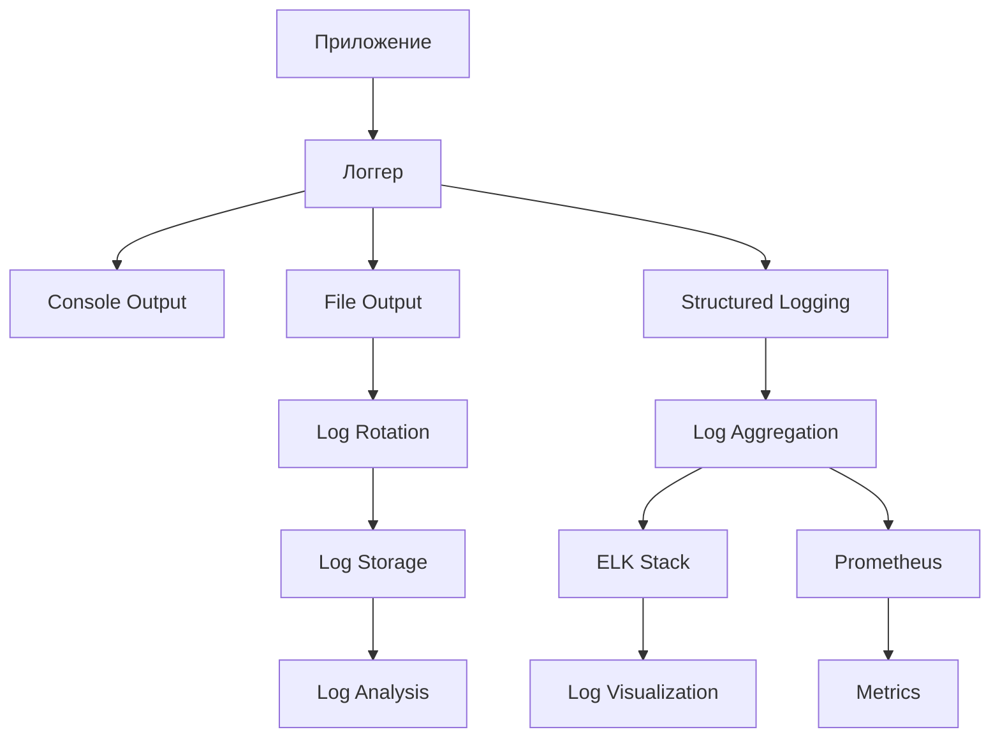

# Система логирования czn-dioxus

Этот документ описывает систему логирования приложения czn-dioxus.

## Обзор логирования

Наша система логирования обеспечивает:

- **Полную видимость** - Полное видение работы приложения
- **Диагностику** - Быстрая диагностика проблем
- **Аудит** - Полная история операций
- **Мониторинг** - Интеграция с системами мониторинга
- **Анализ** - Возможность анализа и агрегации

## Архитектура логирования



## Уровни логирования

### 1. Trace

**Описание**: Самый детальный уровень, для глубокой отладки

**Использование**:
- Детальные шаги выполнения
- Вход/выход из функций
- Значения переменных

**Пример**:
```rust
use tracing::trace;

fn process_certificate(cert: &CertificateInfo) {
    trace!("Начало обработки сертификата: {}", cert.subject_name);
    
    // Логика обработки
    
    trace!("Завершение обработки сертификата: {}", cert.subject_name);
}
```

### 2. Debug

**Описание**: Отладочная информация для разработчиков

**Использование**:
- Отладка алгоритмов
- Проверка состояния системы
- Разработка и тестирование

**Пример**:
```rust
use tracing::debug;

fn load_certificates() -> Result<Vec<CertificateInfo>, AppError> {
    debug!("Начало загрузки сертификатов");
    
    let certificates = find_certificates()?;
    
    debug!("Загружено сертификатов: {}", certificates.len());
    
    Ok(certificates)
}
```

### 3. Info

**Описание**: Информационные сообщения о нормальной работе

**Использование**:
- Старт/стоп приложения
- Основные операции
- Статистика

**Пример**:
```rust
use tracing::info;

fn sign_document(cert: &CertificateInfo, file: &Path) -> Result<String, AppError> {
    info!("Начало подписи документа: {}", file.display());
    
    let result = sign_file_with_certificate(cert, file)?;
    
    info!("Документ подписан: {}", result);
    
    Ok(result)
}
```

### 4. Warn

**Описание**: Предупреждения о потенциальных проблемах

**Использование**:
- Нестандартные ситуации
- Возможные проблемы
- Рекомендации

**Пример**:
```rust
use tracing::warn;

fn validate_certificate(cert: &CertificateInfo) -> ValidationResult {
    if cert.is_expired() {
        warn!("Сертификат просрочен: {}", cert.subject_name);
        return ValidationResult::Expired;
    }
    
    ValidationResult::Valid
}
```

### 5. Error

**Описание**: Ошибки, требующие внимания

**Использование**:
- Ошибки выполнения
- Сбои системы
- Критические проблемы

**Пример**:
```rust
use tracing::error;

fn handle_signing_error(error: &AppError) {
    error!("Ошибка подписи документа: {}", error);
    
    // Логика обработки ошибки
}
```

## Структурированное логирование

### 1. JSON формат

**Преимущества**:
- Машиночитаемость
- Простота парсинга
- Интеграция с системами анализа

**Пример**:
```json
{
  "timestamp": "2024-01-01T12:00:00Z",
  "level": "INFO",
  "module": "certificate",
  "message": "Сертификат загружен",
  "data": {
    "subject_name": "Test Certificate",
    "issuer_name": "Test CA",
    "valid_to": "2025-12-31",
    "thumbprint": "abcdef1234567890"
  },
  "user_id": "user123",
  "session_id": "session456",
  "request_id": "req789"
}
```

### 2. Реализация

```rust
use serde_json::json;
use tracing::{event, Level};

fn log_certificate_operation(
    operation: &str,
    certificate: &CertificateInfo,
    result: &str,
    details: Option<&str>
) {
    let log_entry = json!({
        "timestamp": chrono::Utc::now().to_rfc3339(),
        "level": "INFO",
        "module": "certificate",
        "operation": operation,
        "certificate": {
            "subject_name": certificate.subject_name,
            "issuer_name": certificate.issuer_name,
            "thumbprint": certificate.thumbprint,
            "valid_to": certificate.valid_to
        },
        "result": result,
        "details": details,
        "user_id": get_current_user_id(),
        "session_id": get_current_session_id(),
        "request_id": get_current_request_id()
    });
    
    event!(Level::INFO, message = log_entry.to_string());
}
```

## Конфигурация логирования

### 1. Конфигурационный файл

```yaml
# logging.yml
logging:
  level: info
  console:
    enabled: true
    level: debug
    format: json
  file:
    enabled: true
    level: info
    path: ./logs/app.log
    max_size: 100MB
    max_files: 10
    format: json
  structured:
    enabled: true
    include_span: true
    include_target: true
  filters:
    - module: "hyper"
      level: warn
    - module: "tokio"
      level: error
```

### 2. Реализация конфигурации

```rust
use serde::{Deserialize, Serialize};
use tracing_subscriber::{layer::SubscriberExt, util::SubscriberInitExt};
use tracing_appender::rolling;

#[derive(Debug, Clone, Serialize, Deserialize)]
pub struct LogConfig {
    pub level: LogLevel,
    pub console: ConsoleConfig,
    pub file: FileConfig,
    pub structured: StructuredConfig,
    pub filters: Vec<LogFilter>,
}

#[derive(Debug, Clone, Serialize, Deserialize)]
pub struct ConsoleConfig {
    pub enabled: bool,
    pub level: LogLevel,
    pub format: LogFormat,
}

#[derive(Debug, Clone, Serialize, Deserialize)]
pub struct FileConfig {
    pub enabled: bool,
    pub level: LogLevel,
    pub path: String,
    pub max_size: String,
    pub max_files: u32,
    pub format: LogFormat,
}

#[derive(Debug, Clone, Serialize, Deserialize)]
pub enum LogLevel {
    Trace,
    Debug,
    Info,
    Warn,
    Error,
}

#[derive(Debug, Clone, Serialize, Deserialize)]
pub enum LogFormat {
    Json,
    Text,
}

impl LogConfig {
    pub fn init(&self) -> Result<(), Box<dyn std::error::Error>> {
        let console_layer = if self.console.enabled {
            let fmt_layer = tracing_subscriber::fmt::layer()
                .with_target(false)
                .with_thread_ids(true)
                .with_thread_names(true)
                .with_file(true)
                .with_line_number(true);
            
            match self.console.format {
                LogFormat::Json => Some(fmt_layer.json()),
                LogFormat::Text => Some(fmt_layer),
            }
        } else {
            None
        };
        
        let file_layer = if self.file.enabled {
            let file_appender = rolling::daily(&self.file.path, "app.log");
            let (non_blocking, _guard) = tracing_appender::non_blocking(file_appender);
            
            let fmt_layer = tracing_subscriber::fmt::layer()
                .with_writer(non_blocking)
                .with_ansi(false);
            
            match self.file.format {
                LogFormat::Json => Some(fmt_layer.json()),
                LogFormat::Text => Some(fmt_layer),
            }
        } else {
            None
        };
        
        let filter_layer = self.create_filter_layer();
        
        tracing_subscriber::registry()
            .with(console_layer)
            .with(file_layer)
            .with(filter_layer)
            .init();
        
        Ok(())
    }
    
    fn create_filter_layer(&self) -> impl tracing_subscriber::layer::Layer<tracing_subscriber::Registry> {
        let mut filter = tracing_subscriber::filter::Targets::new();
        
        // Уровень по умолчанию
        filter = filter.with_default(self.level.to_level_filter());
        
        // Фильтры модулей
        for filter_config in &self.filters {
            filter = filter.with_target(
                &filter_config.module,
                filter_config.level.to_level_filter()
            );
        }
        
        filter
    }
}

impl LogLevel {
    fn to_level_filter(&self) -> tracing::metadata::LevelFilter {
        match self {
            LogLevel::Trace => tracing::metadata::LevelFilter::TRACE,
            LogLevel::Debug => tracing::metadata::LevelFilter::DEBUG,
            LogLevel::Info => tracing::metadata::LevelFilter::INFO,
            LogLevel::Warn => tracing::metadata::LevelFilter::WARN,
            LogLevel::Error => tracing::metadata::LevelFilter::ERROR,
        }
    }
}
```

## Логирование операций

### 1. Сертификаты

```rust
use tracing::{info, warn, error};

pub fn log_certificate_load(certificates: &[CertificateInfo]) {
    info!(
        "Загружено сертификатов: {}",
        certificates.len()
    );
    
    let valid_count = certificates.iter().filter(|c| c.is_valid()).count();
    let expired_count = certificates.iter().filter(|c| c.is_expired()).count();
    
    info!(
        "Статистика сертификатов: действительных={}, просроченных={}",
        valid_count, expired_count
    );
}

pub fn log_certificate_error(error: &AppError, certificate: Option<&CertificateInfo>) {
    match error {
        AppError::CertificateNotFound { thumbprint } => {
            warn!(
                "Сертификат не найден: thumbprint={}",
                thumbprint
            );
        },
        AppError::CertificateExpired { thumbprint } => {
            error!(
                "Просроченный сертификат: thumbprint={}",
                thumbprint
            );
        },
        _ => {
            error!("Ошибка сертификата: error={:?}", error);
        }
    }
}
```

### 2. Подпись документов

```rust
use tracing::{info, warn, error};
use std::path::Path;

pub fn log_signing_start(file_path: &Path, certificate: &CertificateInfo) {
    info!(
        "Начало подписи документа: file={}, certificate={}",
        file_path.display(),
        certificate.subject_name
    );
}

pub fn log_signing_success(result: &str, duration: std::time::Duration) {
    info!(
        "Документ успешно подписан: result={}, duration={:?}",
        result,
        duration
    );
}

pub fn log_signing_error(error: &AppError, file_path: &Path) {
    match error {
        AppError::FileNotFound { path } => {
            warn!(
                "Файл не найден: file={}",
                path
            );
        },
        AppError::InvalidFileExtension { extension } => {
            warn!(
                "Неподдерживаемое расширение файла: extension={}",
                extension
            );
        },
        AppError::SigningFailed { reason } => {
            error!(
                "Ошибка подписи: file={}, reason={}",
                file_path.display(),
                reason
            );
        },
        _ => {
            error!(
                "Неизвестная ошибка подписи: file={}, error={:?}",
                file_path.display(),
                error
            );
        }
    }
}
```

### 3. Системные операции

```rust
use tracing::{info, warn, error};
use sysinfo::{System, SystemExt};

pub fn log_system_info() {
    let mut sys = System::new_all();
    sys.refresh_all();
    
    info!(
        "Системная информация: cpu_cores={}, memory_total={}MB, memory_used={}MB",
        sys.cpus().len(),
        sys.total_memory() / 1024 / 1024,
        sys.used_memory() / 1024 / 1024
    );
}

pub fn log_memory_usage() {
    let mut sys = System::new_all();
    sys.refresh_memory();
    
    let memory_usage = sys.used_memory();
    let total_memory = sys.total_memory();
    let usage_percent = (memory_usage as f64 / total_memory as f64) * 100.0;
    
    if usage_percent > 80.0 {
        warn!(
            "Высокое потребление памяти: usage={:.2}%, used={}MB, total={}MB",
            usage_percent,
            memory_usage / 1024 / 1024,
            total_memory / 1024 / 1024
        );
    } else {
        info!(
            "Потребление памяти: usage={:.2}%, used={}MB, total={}MB",
            usage_percent,
            memory_usage / 1024 / 1024,
            total_memory / 1024 / 1024
        );
    }
}
```

## Логирование безопасности

### 1. Аудит операций

```rust
use serde_json::json;

#[derive(Debug, Clone)]
pub struct SecurityLog {
    pub timestamp: chrono::DateTime<chrono::Utc>,
    pub user_id: Option<String>,
    pub session_id: Option<String>,
    pub operation: String,
    pub resource: String,
    pub result: String,
    pub details: Option<String>,
    pub ip_address: Option<String>,
    pub user_agent: Option<String>,
}

pub fn log_security_event(
    operation: &str,
    resource: &str,
    result: &str,
    details: Option<&str>
) {
    let log_entry = SecurityLog {
        timestamp: chrono::Utc::now(),
        user_id: get_current_user_id(),
        session_id: get_current_session_id(),
        operation: operation.to_string(),
        resource: resource.to_string(),
        result: result.to_string(),
        details: details.map(|s| s.to_string()),
        ip_address: get_client_ip(),
        user_agent: get_user_agent(),
    };
    
    // Сохранение в защищенное хранилище
    secure_log_storage::write(&log_entry);
    
    // Отправка в систему мониторинга
    send_to_security_monitoring(&log_entry);
    
    // Логирование в structured format
    let json_log = json!({
        "timestamp": log_entry.timestamp.to_rfc3339(),
        "type": "security",
        "operation": log_entry.operation,
        "resource": log_entry.resource,
        "result": log_entry.result,
        "user_id": log_entry.user_id,
        "session_id": log_entry.session_id,
        "ip_address": log_entry.ip_address,
        "user_agent": log_entry.user_agent,
        "details": log_entry.details
    });
    
    tracing::info!(target: "security", "{}", json_log.to_string());
}
```

### 2. Мониторинг подозрительной активности

```rust
use std::collections::HashMap;
use std::time::{Duration, Instant};

struct SecurityMonitor {
    failed_attempts: HashMap<String, u32>,
    last_reset: HashMap<String, Instant>,
    suspicious_ips: HashMap<String, Instant>,
}

impl SecurityMonitor {
    pub fn check_failed_attempts(&mut self, user_id: &str) -> Result<(), AppError> {
        let now = Instant::now();
        let key = user_id.to_string();
        
        // Сброс счетчика каждые 15 минут
        if let Some(last_reset) = self.last_reset.get(&key) {
            if now.duration_since(*last_reset) > Duration::from_secs(900) {
                self.failed_attempts.remove(&key);
                self.last_reset.insert(key.clone(), now);
            }
        } else {
            self.last_reset.insert(key.clone(), now);
        }
        
        // Проверка количества неудачных попыток
        let attempts = self.failed_attempts.entry(key.clone()).or_insert(0);
        *attempts += 1;
        
        if *attempts > 5 {
            // Блокировка пользователя
            self.block_user(user_id)?;
            
            // Логирование инцидента
            log_security_event(
                "user_blocked",
                &format!("user:{}", user_id),
                "failed_attempts_limit_exceeded",
                Some(&format!("Failed attempts: {}", *attempts))
            );
            
            return Err(AppError::TooManyFailedAttempts { 
                user_id: user_id.to_string(),
                attempts: *attempts 
            });
        }
        
        Ok(())
    }
    
    pub fn check_suspicious_activity(&mut self, ip_address: &str) -> bool {
        let now = Instant::now();
        
        if let Some(last_activity) = self.suspicious_ips.get(ip_address) {
            if now.duration_since(*last_activity) < Duration::from_secs(60) {
                // Подозрительная активность - слишком частые запросы
                log_security_event(
                    "suspicious_activity",
                    &format!("ip:{}", ip_address),
                    "rate_limit_exceeded",
                    Some("Too many requests from single IP")
                );
                return true;
            }
        }
        
        self.suspicious_ips.insert(ip_address.to_string(), now);
        false
    }
}
```

## Логирование производительности

### 1. Тайминги операций

```rust
use std::time::Instant;
use tracing::{info, warn};

pub struct TimingLogger {
    start_time: Instant,
    operation: String,
}

impl TimingLogger {
    pub fn new(operation: String) -> Self {
        Self {
            start_time: Instant::now(),
            operation,
        }
    }
    
    pub fn finish(self, result: &str) {
        let duration = self.start_time.elapsed();
        
        info!(
            "Операция завершена: operation={}, result={}, duration={:?}",
            self.operation,
            result,
            duration
        );
        
        // Предупреждение о долгих операциях
        if duration.as_secs() > 10 {
            warn!(
                "Длительная операция: operation={}, duration={:?}",
                self.operation,
                duration
            );
        }
    }
}

// Макрос для удобного использования
macro_rules! timed_operation {
    ($operation:expr, $block:block) => {{
        let _timer = TimingLogger::new($operation.to_string());
        let result = $block;
        _timer.finish("success");
        result
    }};
    ($operation:expr, $error_msg:expr, $block:block) => {{
        let _timer = TimingLogger::new($operation.to_string());
        let result = $block;
        match &result {
            Ok(_) => _timer.finish("success"),
            Err(e) => _timer.finish(&format!("error: {}", e)),
        }
        result
    }};
}

// Использование
pub fn sign_document_with_timing(cert: &CertificateInfo, file: &Path) -> Result<String, AppError> {
    timed_operation!("document_signing", {
        sign_file_with_certificate(cert, file)
    })
}
```

### 2. Метрики производительности

```rust
use prometheus::{Histogram, register_histogram};

lazy_static! {
    static ref OPERATION_DURATION: Histogram = register_histogram!(
        "czn_operation_duration_seconds",
        "Duration of operations"
    ).unwrap();
    
    static ref CERTIFICATE_LOAD_DURATION: Histogram = register_histogram!(
        "czn_certificate_load_duration_seconds",
        "Duration of certificate loading"
    ).unwrap();
}

pub fn measure_operation<F, T>(operation: &str, f: F) -> T 
where
    F: FnOnce() -> T,
{
    let timer = match operation {
        "certificate_load" => CERTIFICATE_LOAD_DURATION.start_timer(),
        _ => OPERATION_DURATION.start_timer(),
    };
    
    let result = f();
    
    timer.observe_duration();
    
    result
}

// Использование
pub fn load_certificates_with_metrics() -> Result<Vec<CertificateInfo>, AppError> {
    measure_operation("certificate_load", || {
        find_certificates()
    })
}
```

## Best Practices

### 1. Логирование ошибок

- **Контекст** - Всегда добавляйте контекст к ошибкам
- **Уровни** - Используйте правильные уровни логирования
- **Безопасность** - Не логируйте чувствительные данные
- **Структура** - Используйте структурированный формат

### 2. Производительность

- **Асинхронность** - Используйте асинхронное логирование
- **Фильтрация** - Фильтруйте ненужные логи
- **Ротация** - Настройте ротацию логов
- **Хранение** - Ограничьте объем хранимых логов

### 3. Безопасность

- **Аудит** - Логируйте все важные операции
- **Защита** - Защищайте логи от несанкционированного доступа
- **Анализ** - Используйте системы анализа логов
- **Оповещения** - Настройте оповещения о подозрительной активности

## Интеграция с системами мониторинга

### 1. ELK Stack

```yaml
# logstash.conf
input {
  file {
    path => "/var/log/czn-dioxus/*.log"
    start_position => "beginning"
    codec => "json"
  }
}

filter {
  if [type] == "security" {
    mutate {
      add_tag => ["security"]
    }
  }
  
  date {
    match => [ "timestamp", "ISO8601" ]
  }
}

output {
  elasticsearch {
    hosts => ["elasticsearch:9200"]
    index => "czn-dioxus-logs-%{+YYYY.MM.dd}"
  }
  
  stdout {
    codec => rubydebug
  }
}
```

### 2. Prometheus

```rust
use prometheus::{register_counter, register_histogram, Counter, Histogram};

lazy_static! {
    static ref LOG_LINES_TOTAL: Counter = register_counter!(
        "czn_log_lines_total",
        "Total number of log lines"
    ).unwrap();
    
    static ref LOG_ERRORS_TOTAL: Counter = register_counter!(
        "czn_log_errors_total",
        "Total number of error logs"
    ).unwrap();
}

// Интеграция с tracing
use tracing_subscriber::layer::SubscriberExt;
use tracing_subscriber::util::SubscriberInitExt;

struct MetricsLayer;

impl<S> tracing_subscriber::Layer<S> for MetricsLayer
where
    S: tracing::Subscriber,
{
    fn on_event(&self, event: &tracing::Event<'_>, _ctx: tracing_subscriber::layer::Context<'_, S>) {
        LOG_LINES_TOTAL.inc();
        
        if let Some(level) = event.metadata().level() {
            if level == &tracing::Level::ERROR {
                LOG_ERRORS_TOTAL.inc();
            }
        }
    }
}
```

## Поддержка логирования

### 1. Документация

- **Log Guidelines** - Руководство по логированию
- **Log Formats** - Форматы логов
- **Log Analysis** - Анализ логов

### 2. Инструменты

- **Log Aggregation** - Сбор логов
- **Log Analysis** - Анализ логов
- **Log Visualization** - Визуализация логов

### 3. Контакты

- **DevOps Team**: devops@czn-dioxus.com
- **Security Team**: security@czn-dioxus.com
- **Monitoring Team**: monitoring@czn-dioxus.com

## Обновления

Последнее обновление: 2024-01-01

Для получения актуальной информации:
- [Tracing Documentation](https://tracing.rs/)
- [ELK Stack Documentation](https://www.elastic.co/guide/)
- [Prometheus Documentation](https://prometheus.io/docs/)
