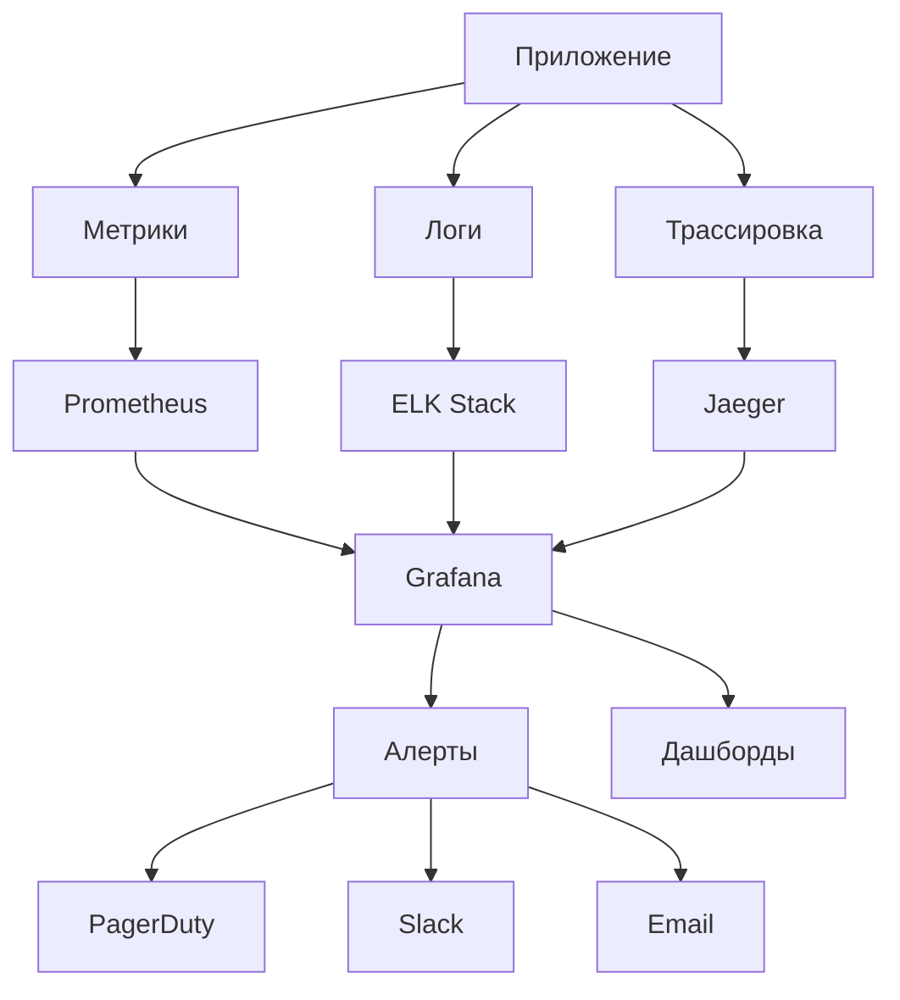

# Мониторинг czn-dioxus

Этот документ описывает систему мониторинга приложения czn-dioxus.

## Обзор мониторинга

Наша система мониторинга обеспечивает:

- **Видимость** - Полная видимость состояния системы
- **Оповещения** - Своевременные оповещения о проблемах
- **Анализ** - Глубокий анализ производительности и поведения
- **Прогнозирование** - Прогнозирование проблем и планирование
- **Автоматизацию** - Автоматическое реагирование на инциденты

## Архитектура мониторинга



## Типы метрик

### 1. Бизнес-метрики

**Цель**: Мониторинг бизнес-показателей

**Примеры**:
```rust
use prometheus::{IntCounter, IntGauge, Histogram, register_int_counter, register_int_gauge, register_histogram};

lazy_static! {
    // Количество подписанных документов
    static ref DOCUMENTS_SIGNED_TOTAL: IntCounter = register_int_counter!(
        "czn_documents_signed_total",
        "Total number of signed documents"
    ).unwrap();
    
    // Количество активных пользователей
    static ref ACTIVE_USERS: IntGauge = register_int_gauge!(
        "czn_active_users",
        "Number of active users"
    ).unwrap();
    
    // Время подписи документа
    static ref SIGNING_DURATION: Histogram = register_histogram!(
        "czn_signing_duration_seconds",
        "Duration of document signing"
    ).unwrap();
    
    // Количество доступных сертификатов
    static ref CERTIFICATES_AVAILABLE: IntGauge = register_int_gauge!(
        "czn_certificates_available",
        "Number of available certificates"
    ).unwrap();
}

// Регистрация бизнес-метрик
pub fn record_document_signed() {
    DOCUMENTS_SIGNED_TOTAL.inc();
}

pub fn update_active_users(count: i64) {
    ACTIVE_USERS.set(count);
}

pub fn record_signing_duration(duration: f64) {
    SIGNING_DURATION.observe(duration);
}

pub fn update_certificates_count(count: i64) {
    CERTIFICATES_AVAILABLE.set(count);
}
```

### 2. Системные метрики

**Цель**: Мониторинг состояния системы

**Примеры**:
```rust
use sysinfo::{System, SystemExt};

lazy_static! {
    // Использование CPU
    static ref CPU_USAGE: Gauge = register_gauge!(
        "czn_cpu_usage_percent",
        "CPU usage percentage"
    ).unwrap();
    
    // Использование памяти
    static ref MEMORY_USAGE: Gauge = register_gauge!(
        "czn_memory_usage_bytes",
        "Memory usage in bytes"
    ).unwrap();
    
    // Использование диска
    static ref DISK_USAGE: Gauge = register_gauge!(
        "czn_disk_usage_bytes",
        "Disk usage in bytes"
    ).unwrap();
    
    // Количество соединений к базе данных
    static ref DB_CONNECTIONS: Gauge = register_gauge!(
        "czn_db_connections",
        "Number of database connections"
    ).unwrap();
}

pub fn collect_system_metrics() {
    let mut sys = System::new_all();
    sys.refresh_all();
    
    // CPU usage
    let cpu_usage: f32 = sys.cpus().iter().map(|c| c.cpu_usage()).sum();
    let cpu_count = sys.cpus().len() as f32;
    CPU_USAGE.set(cpu_usage / cpu_count);
    
    // Memory usage
    MEMORY_USAGE.set(sys.used_memory() as f64);
    
    // Disk usage
    for disk in sys.disks() {
        DISK_USAGE.set(disk.total_space() as f64);
    }
    
    // Database connections
    // Здесь можно добавить метрику количества активных соединений к БД
}
```

### 3. Прикладные метрики

**Цель**: Мониторинг производительности приложения

**Примеры**:
```rust
lazy_static! {
    // HTTP запросы
    static ref HTTP_REQUESTS_TOTAL: IntCounterVec = register_int_counter_vec!(
        "czn_http_requests_total",
        "Total number of HTTP requests",
        &["method", "endpoint", "status"]
    ).unwrap();
    
    // HTTP время ответа
    static ref HTTP_REQUEST_DURATION: HistogramVec = register_histogram_vec!(
        "czn_http_request_duration_seconds",
        "HTTP request duration",
        &["method", "endpoint"],
        vec![0.1, 0.5, 1.0, 2.0, 5.0, 10.0]
    ).unwrap();
    
    // Ошибки приложения
    static ref APP_ERRORS_TOTAL: IntCounterVec = register_int_counter_vec!(
        "czn_app_errors_total",
        "Total number of application errors",
        &["error_type", "component"]
    ).unwrap();
    
    // Размер очереди задач
    static ref TASK_QUEUE_SIZE: Gauge = register_gauge!(
        "czn_task_queue_size",
        "Size of task queue"
    ).unwrap();
}

// Middleware для HTTP метрик
pub async fn metrics_middleware<B>(
    req: Request<B>,
    next: Next<B>,
) -> Result<Response, StatusCode> {
    let start = Instant::now();
    let method = req.method().to_string();
    let path = req.uri().path().to_string();
    
    let response = next.run(req).await;
    
    let duration = start.elapsed().as_secs_f64();
    let status = response.status().as_u16().to_string();
    
    HTTP_REQUESTS_TOTAL
        .with_label_values(&[&method, &path, &status])
        .inc();
    
    HTTP_REQUEST_DURATION
        .with_label_values(&[&method, &path])
        .observe(duration);
    
    Ok(response)
}

// Регистрация ошибок
pub fn record_error(error_type: &str, component: &str) {
    APP_ERRORS_TOTAL
        .with_label_values(&[error_type, component])
        .inc();
}
```

### 4. Инфраструктурные метрики

**Цель**: Мониторинг инфраструктуры

**Примеры**:
```yaml
# node_exporter configuration
global:
  scrape_interval: 15s
  evaluation_interval: 15s

rule_files:
  - "alert_rules.yml"

scrape_configs:
  - job_name: 'czn-dioxus'
    static_configs:
      - targets: ['localhost:9090']
  
  - job_name: 'node'
    static_configs:
      - targets: ['localhost:9100']
  
  - job_name: 'postgres'
    static_configs:
      - targets: ['localhost:9187']

alerting:
  alertmanagers:
    - static_configs:
        - targets:
          - localhost:9093
```

## Логирование и агрегация

### 1. Структурированное логирование

```rust
use tracing::{info, warn, error, span, Level};
use tracing_subscriber::{layer::SubscriberExt, util::SubscriberInitExt};

pub fn init_logging() {
    let file_appender = tracing_appender::rolling::daily("./logs", "app.log");
    let (non_blocking, _guard) = tracing_appender::non_blocking(file_appender);
    
    tracing_subscriber::registry()
        .with(
            tracing_subscriber::fmt::layer()
                .with_writer(std::io::stdout)
                .with_target(false)
                .with_thread_ids(true)
                .with_thread_names(true)
        )
        .with(
            tracing_subscriber::fmt::layer()
                .with_writer(non_blocking)
                .with_ansi(false)
                .json()
        )
        .init();
}

// Логирование с метриками
pub fn log_with_metrics(operation: &str, duration: std::time::Duration, success: bool) {
    let span = span!(
        Level::INFO,
        "operation",
        operation = operation,
        duration = ?duration,
        success = success
    );
    
    let _enter = span.enter();
    
    if success {
        info!("Operation completed successfully");
    } else {
        error!("Operation failed");
    }
}
```

### 2. Централизованное логирование

```yaml
# docker-compose.logging.yml
version: '3.8'

services:
  elasticsearch:
    image: elasticsearch:7.15.0
    environment:
      - discovery.type=single-node
    volumes:
      - elasticsearch_data:/usr/share/elasticsearch/data
      
  kibana:
    image: kibana:7.15.0
    ports:
      - "5601:5601"
    environment:
      - ELASTICSEARCH_HOSTS=http://elasticsearch:9200
      
  logstash:
    image: logstash:7.15.0
    volumes:
      - ./logstash.conf:/usr/share/logstash/pipeline/logstash.conf
    depends_on:
      - elasticsearch
      
  fluentd:
    image: fluent/fluentd:v1.14-debian-1
    volumes:
      - ./fluentd.conf:/fluentd/etc/fluent.conf
      - ./logs:/var/log/app
    depends_on:
      - elasticsearch

volumes:
  elasticsearch_data:
```

### 3. Logstash конфигурация

```ruby
# logstash.conf
input {
  file {
    path => "/var/log/app/*.log"
    start_position => "beginning"
    codec => "json"
  }
  
  beats {
    port => 5044
  }
}

filter {
  if [type] == "security" {
    mutate {
      add_tag => ["security"]
    }
  }
  
  if [level] == "ERROR" {
    mutate {
      add_tag => ["error"]
    }
  }
  
  date {
    match => [ "timestamp", "ISO8601" ]
  }
  
  geoip {
    source => "client_ip"
  }
}

output {
  elasticsearch {
    hosts => ["elasticsearch:9200"]
    index => "czn-dioxus-logs-%{+YYYY.MM.dd}"
  }
  
  stdout {
    codec => rubydebug
  }
}
```

## Трассировка

### 1. Distributed tracing

```rust
use opentelemetry::{global, trace::Tracer};
use opentelemetry_otlp::WithExportConfig;
use opentelemetry_sdk::trace::Sampler;

pub fn init_tracing() -> Result<(), Box<dyn std::error::Error>> {
    global::set_text_map_propagator(opentelemetry_jaeger::Propagator::new());
    
    let tracer = opentelemetry_otlp::new_pipeline()
        .tracing()
        .with_exporter(
            opentelemetry_otlp::new_exporter()
                .tonic()
                .with_endpoint("http://jaeger:14250")
        )
        .with_trace_config(
            opentelemetry_sdk::trace::config()
                .with_sampler(Sampler::AlwaysOn)
                .with_max_events_per_span(64)
                .with_max_attributes_per_span(16)
                .with_max_events_per_span(16)
        )
        .install_batch(opentelemetry_sdk::runtime::Tokio)?;
    
    global::set_tracer_provider(tracer);
    
    Ok(())
}

// Использование трассировки
pub async fn sign_document_with_tracing(
    certificate: &CertificateInfo,
    file: &Path
) -> Result<String, AppError> {
    let tracer = global::tracer("czn-dioxus");
    
    let span = tracer.start("document_signing");
    let _guard = span.span_context().clone();
    
    let result = sign_file_with_certificate(certificate, file).await;
    
    match &result {
        Ok(_) => span.add_event("Signing completed successfully".to_string(), vec![]),
        Err(e) => span.add_event(format!("Signing failed: {}", e), vec![]),
    }
    
    result
}
```

### 2. Jaeger конфигурация

```yaml
# docker-compose.jaeger.yml
version: '3.8'

services:
  jaeger-collector:
    image: jaegertracing/jaeger-collector:1.30
    command:
      - "--cassandra.keyspace=jaeger_v1_dc1"
      - "--cassandra.servers=cassandra"
      - "--collector.zipkin.http-port=9411"
    ports:
      - "14269:14269"
      - "14268:14268"
      - "14250:14250"
      - "9411:9411"
    restart: on-failure

  jaeger-query:
    image: jaegertracing/jaeger-query:1.30
    command:
      - "--cassandra.keyspace=jaeger_v1_dc1"
      - "--cassandra.servers=cassandra"
    ports:
      - "16686:16686"
      - "16687:16687"
    restart: on-failure

  jaeger-agent:
    image: jaegertracing/jaeger-agent:1.30
    command: ["--reporter.grpc.host-port=cassandra:14250"]
    ports:
      - "5775:5775/udp"
      - "6831:6831/udp"
      - "6832:6832/udp"
      - "5778:5778"
    restart: on-failure
    depends_on:
      - jaeger-collector

  cassandra:
    image: cassandra:3.11
    environment:
      CASSANDRA_CLUSTER_NAME: jaeger
      CASSANDRA_DC: dc1
      CASSANDRA_RACK: rack1
    ports:
      - "9042:9042"
```

## Алертинг

### 1. Prometheus алерты

```yaml
# alert_rules.yml
groups:
  - name: application_alerts
    rules:
      - alert: HighErrorRate
        expr: rate(czn_app_errors_total[5m]) > 0.1
        for: 2m
        labels:
          severity: warning
        annotations:
          summary: "High error rate detected"
          description: "Error rate is {{ $value }} errors per second"
      
      - alert: HighResponseTime
        expr: histogram_quantile(0.95, rate(czn_http_request_duration_seconds_bucket[5m])) > 2
        for: 5m
        labels:
          severity: warning
        annotations:
          summary: "High response time detected"
          description: "95th percentile response time is {{ $value }} seconds"
      
      - alert: LowCertificateCount
        expr: czn_certificates_available < 5
        for: 1m
        labels:
          severity: critical
        annotations:
          summary: "Low certificate count"
          description: "Only {{ $value }} certificates available"
      
      - alert: HighMemoryUsage
        expr: czn_memory_usage_percent > 80
        for: 5m
        labels:
          severity: warning
        annotations:
          summary: "High memory usage"
          description: "Memory usage is {{ $value }}%"

  - name: infrastructure_alerts
    rules:
      - alert: ServiceDown
        expr: up{job="czn-dioxus"} == 0
        for: 1m
        labels:
          severity: critical
        annotations:
          summary: "Service is down"
          description: "Service {{ $labels.instance }} has been down for more than 1 minute"
      
      - alert: HighCPUUsage
        expr: czn_cpu_usage_percent > 80
        for: 5m
        labels:
          severity: warning
        annotations:
          summary: "High CPU usage"
          description: "CPU usage is {{ $value }}%"
```

### 2. AlertManager конфигурация

```yaml
# alertmanager.yml
global:
  smtp_smarthost: 'localhost:587'
  smtp_from: 'alerts@czn-dioxus.com'

route:
  group_by: ['alertname']
  group_wait: 10s
  group_interval: 10s
  repeat_interval: 1h
  receiver: 'web.hook'
  routes:
  - match:
      severity: critical
    receiver: 'critical-alerts'
  - match:
      severity: warning
    receiver: 'warning-alerts'

receivers:
- name: 'web.hook'
  webhook_configs:
  - url: 'http://127.0.0.1:5001/'

- name: 'critical-alerts'
  email_configs:
  - to: 'oncall@czn-dioxus.com'
    subject: '[CRITICAL] {{ .GroupLabels.alertname }}'
    body: |
      {{ range .Alerts }}
      Alert: {{ .Annotations.summary }}
      Description: {{ .Annotations.description }}
      {{ end }}
  
  slack_configs:
  - api_url: 'https://hooks.slack.com/services/...'
    channel: '#alerts-critical'
    title: 'Critical Alert'
    text: '{{ range .Alerts }}{{ .Annotations.summary }}{{ end }}'

- name: 'warning-alerts'
  email_configs:
  - to: 'team@czn-dioxus.com'
    subject: '[WARNING] {{ .GroupLabels.alertname }}'
    body: |
      {{ range .Alerts }}
      Alert: {{ .Annotations.summary }}
      Description: {{ .Annotations.description }}
      {{ end }}
```

## Дашборды

### 1. Grafana дашборды

```json
{
  "dashboard": {
    "id": null,
    "title": "czn-dioxus Monitoring",
    "tags": ["czn-dioxus", "monitoring"],
    "timezone": "browser",
    "panels": [
      {
        "id": 1,
        "title": "HTTP Requests Rate",
        "type": "graph",
        "targets": [
          {
            "expr": "rate(czn_http_requests_total[5m])",
            "legendFormat": "{{method}} {{endpoint}}"
          }
        ],
        "yAxes": [
          {
            "label": "Requests/sec"
          }
        ]
      },
      {
        "id": 2,
        "title": "Response Time",
        "type": "graph",
        "targets": [
          {
            "expr": "histogram_quantile(0.95, rate(czn_http_request_duration_seconds_bucket[5m]))",
            "legendFormat": "95th percentile"
          },
          {
            "expr": "histogram_quantile(0.50, rate(czn_http_request_duration_seconds_bucket[5m]))",
            "legendFormat": "50th percentile"
          }
        ]
      },
      {
        "id": 3,
        "title": "Error Rate",
        "type": "singlestat",
        "targets": [
          {
            "expr": "rate(czn_app_errors_total[5m])"
          }
        ],
        "format": "reqps"
      },
      {
        "id": 4,
        "title": "System Resources",
        "type": "graph",
        "targets": [
          {
            "expr": "czn_cpu_usage_percent",
            "legendFormat": "CPU Usage"
          },
          {
            "expr": "czn_memory_usage_bytes / 1024 / 1024 / 1024",
            "legendFormat": "Memory Usage (GB)"
          }
        ]
      }
    ],
    "time": {
      "from": "now-1h",
      "to": "now"
    },
    "refresh": "30s"
  }
}
```

### 2. Kibana визуализация

```json
{
  "title": "czn-dioxus Logs",
  "type": "logs",
  "timeFieldName": "@timestamp",
  "fields": [
    {
      "name": "@timestamp",
      "type": "date",
      "searchable": true,
      "aggregatable": true
    },
    {
      "name": "level",
      "type": "string",
      "searchable": true,
      "aggregatable": true
    },
    {
      "name": "message",
      "type": "string",
      "searchable": true,
      "aggregatable": false
    },
    {
      "name": "component",
      "type": "string",
      "searchable": true,
      "aggregatable": true
    }
  ]
}
```

## Best Practices

### 1. Метрики

- **RED метод** - Rate, Errors, Duration
- **USE метод** - Utilization, Saturation, Errors
- **Четкие имена** - Понятные имена метрик
- **Лейблы** - Ограничение количества лейблов
- **Гранулярность** - Подходящая гранулярность метрик

### 2. Логирование

- **Структурированность** - JSON формат логов
- **Контекст** - Достаточный контекст в логах
- **Уровни** - Правильное использование уровней логирования
- **Агрегация** - Централизованное хранение логов

### 3. Трассировка

- **End-to-end** - Полная трассировка запросов
- **Контекст** - Передача контекста между сервисами
- **Образцы** - Настройка образцов трассировки
- **Хранение** - Ограничение хранения трассировок

### 4. Алертинг

- **Сигнализация** - Только важные алерты
- **Четкость** - Понятные сообщения
- **Автоматизация** - Автоматическое реагирование
- **Тестирование** - Тестирование алертов

## Поддержка мониторинга

### 1. Документация

- **Monitoring Guide** - Руководство по мониторингу
- **Dashboard Templates** - Шаблоны дашбордов
- **Alert Rules** - Правила алертинга
- **Troubleshooting** - Решение проблем

### 2. Инструменты

- **Monitoring Stack** - Комплекс инструментов мониторинга
- **Alert Management** - Система управления алертами
- **Log Analysis** - Инструменты анализа логов
- **Performance Analysis** - Инструменты анализа производительности

### 3. Контакты

- **Monitoring Team**: monitoring@czn-dioxus.com
- **On-call**: +7 (495) 123-45-67
- **Alerts**: alerts@czn-dioxus.com

## Обновления

Последнее обновление: 2024-01-01

Для получения актуальной информации:
- [Prometheus Documentation](https://prometheus.io/docs/)
- [Grafana Documentation](https://grafana.com/docs/)
- [ELK Stack Documentation](https://www.elastic.co/guide/)
- [Jaeger Documentation](https://www.jaegertracing.io/docs/)
